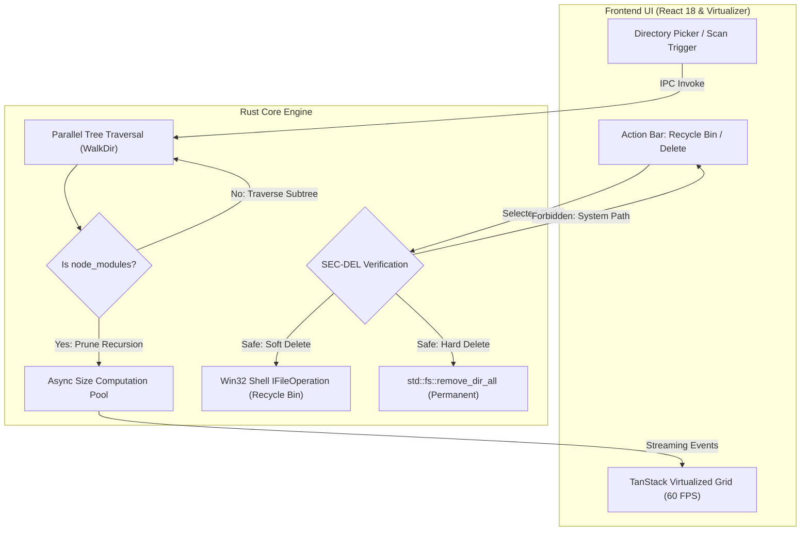

<div align="center">

# 🧹 Node Cleaner — Hızlı & Güvenli node_modules Temizleme Aracı

</div>

---

<div align="center">

[](#english-version)
&nbsp;&nbsp;&nbsp;&nbsp;
[](#turkish-version)

</div>

---

<div align="center">


</div>

---

<a id="english-version"></a>
# English Version

<div align="center">
  
  <h3>Node Cleaner — High-Performance Disk Space Reclaimer & node_modules Cleaner</h3>
  <p><em>Ultra-Fast Discovery, Monorepo Hierarchy Grouping & Safe Deletion for JavaScript & TypeScript Workspaces</em></p>
  <p><strong>Developed & Published by <a href="https://vellium.dev">Vellium</a></strong></p>
</div>

<br>

## 💻 Project Overview

**Node Cleaner** is an enterprise-grade, high-performance Windows desktop application built with **Tauri 2.0 (Rust)** and **React 18 (TypeScript)**. It empowers web developers, software engineers, and DevOps teams to instantly discover forgotten, bloated `node_modules` folders across multiple hard drives and workspaces, calculate exact disk footprints asynchronously, and safely delete them to reclaim gigabytes of storage space.

Traditional filesystem scanners freeze system I/O by recursing deep into nested dependency subfolders. **Node Cleaner** solves this with an **Optimized Pruning Directory Traversal Engine**: as soon as a `node_modules` directory is discovered, deep recursive traversal is bypassed, and size calculation is offloaded to asynchronous worker pools.

With strict **Multi-Layer Safety Verification (`SEC-DEL`)**, protected system folders (like `C:\Windows`, `Program Files`, and user profile roots) cannot be selected or deleted. Node Cleaner supports both reversible **Windows Recycle Bin** soft deletion (`IFileOperation` / `SHFileOperationW`) and lightning-fast **Permanent** deletion with interactive confirmations.

Node Cleaner operates **100% locally** with zero telemetry, zero analytics, and zero external network dependencies.

---

## 🚀 Key Features

- **⚡ Blazing-Fast Discovery Engine**: Traverses massive disk trees with millisecond response times, instantly skipping nested sub-directory recursion inside `node_modules` to find hundreds of projects without UI stutter.
- **🛡️ Multi-Layer Safety Guard (`SEC-DEL`)**: Hardened path boundary checks prevent deletion of Windows system directories, user root folders, non-`node_modules` targets, or drive roots (`C:\`).
- **📦 Monorepo & Workspace Hierarchy Detection**: Intelligently groups nested package folders under their respective monorepo root workspaces (`pnpm-workspace`, `Turbo`, `Lerna`, `Nx`, `Yarn Workspaces`, `Bun`).
- **🎛️ Two-Stage Safe Deletion**:
  - **Recycle Bin (Reversible)**: Native Win32 Shell API integration (`IFileOperation`) allowing instant recovery from Windows Recycle Bin.
  - **Permanent Deletion**: Asynchronous high-throughput directory purge with double confirmation dialogs.
- **📊 60 FPS Virtualized Grid**: TanStack Virtualizer powers buttery-smooth 60 FPS scrolling and rendering even across 10,000+ discovered project entries with zero DOM overhead.
- **🌐 73-Language Localization (i18n)**: 100% full translation coverage across 73 independent regional languages with instant in-app switching and zero reload time.
- **🎨 Modern Dark-Transparent Glassmorphism UI**: Custom frameless window styling with curated dark aesthetic design tokens, smooth animations, and responsive layouts.
- **🔍 Real-Time Search & Sorting**: Filter projects by name, filesystem path, or package manager (`npm`, `pnpm`, `yarn`, `bun`), and sort by largest disk size or oldest modified date.
- **🔒 100% Offline & Private**: Zero telemetry, zero analytics, zero external network requests.

---

## 🛠️ Tech Stack

<div align="center">


</div>

### Backend & Core Engine (Rust)
- **Tauri 2.2**: Native Windows runtime integration, frameless window styling, and secure IPC bridge
- **WalkDir 2.5**: Optimized directory traversal with custom pruning logic
- **Trash 5.2**: Native Windows Recycle Bin COM integration
- **Tokio 1.49**: Asynchronous multi-threaded background disk scanning and task management
- **Windows API (`windows-rs` 0.58)**: Native Win32 Shell (`IFileOperation`), UI, and COM subsystem bindings
- **Single Instance Plugin**: `tauri-plugin-single-instance` for single-process mutex enforcement

### Frontend & User Interface (React & TypeScript)
- **React 18 & TypeScript 5.7**: Component-driven reactive user interface with strict typing
- **TanStack React Virtual 3.13**: Window-level DOM virtualization for high-density tabular data
- **Zustand 5.0**: Reactive state management (`useScannerStore`, `useSettingsStore`)
- **Lucide React**: Clean, modern SVG icon set
- **Custom CSS Design Tokens**: Zero-framework vanilla CSS with CSS variables, HSL color system, glassmorphism, and responsive layouts

---

## 📁 Project Structure

```tree
Node-Cleaner/
├── assets/                         # Vector brand assets & master logo
│   └── brand/                      # app-icon.svg, logo-master.svg
├── public/                         # Public static web assets
│   └── vellium.svg                 # Publisher logo
├── release_output/                 # Production builds & distribution artifacts
│   ├── Node-Cleaner-1.0.0-x64-Setup.exe   # NSIS Setup Installer (Single & Multi-user)
│   ├── Node-Cleaner-1.0.0-x64.msi         # MSI Enterprise Installer
│   ├── Node-Cleaner-1.0.0-Portable.exe    # Standalone Portable Binary
│   ├── SHA256SUMS.txt                     # Cryptographic SHA-256 checksums
│   └── verify-checksums.bat               # 1-Click SHA-256 verification tool
├── scripts/                        # Automated build & verification tools
│   ├── build-release.js            # Release builder (Clean -> Build -> Package -> Hash)
│   ├── check-version.js            # Cross-file version consistency validator
│   └── verify-checksums.bat        # Windows batch checksum verifier
├── src/                            # Frontend application source (React 18 + TS)
│   ├── components/                 # Shared UI primitives (Button, Dialog, Toast, SearchField)
│   ├── features/                   # Feature-driven domain modules
│   │   ├── deletion/               # Permanent & Recycle Bin confirmation dialogs
│   │   ├── results/                # Virtualized table, project groups & selection action bar
│   │   ├── scan/                   # Scan hero, scan header, directory picker & progress
│   │   └── settings/               # Settings modal, language selector, legal & about views
│   ├── lib/                        # Tauri IPC scanner API client & utilities
│   ├── locales/                    # 73-language localization engine (i18n)
│   │   ├── langs/                  # Language dictionaries (tr.ts, en.ts, de.ts, etc.)
│   │   └── index.ts                # Locale management & reactive translation hook
│   ├── stores/                     # Zustand stores (useScannerStore, useSettingsStore)
│   ├── types/                      # Global TypeScript definitions
│   ├── App.tsx                     # Main layout & orchestrator
│   └── main.tsx                    # React DOM entry point
├── src-tauri/                      # Rust backend & platform engine
│   ├── icons/                      # App icons (8-layer ICO, ICNS, PNGs, StoreLogo, Splash)
│   ├── nsis/                       # NSIS installer bitmaps & hooks (header.bmp, hooks.nsh)
│   ├── src/
│   │   ├── commands/               # Tauri IPC command handlers
│   │   ├── deletion/               # Safe deletion service (Recycle Bin & Permanent)
│   │   ├── error/                  # Domain error types & result wrappers
│   │   ├── platform/               # Windows Shell & Win32 system bindings
│   │   ├── scanner/                # Parallel filesystem scanner & size calculator
│   │   ├── settings/               # Settings persistence models
│   │   ├── lib.rs                  # Plugin registry & command router
│   │   └── main.rs                 # Native application entry point
│   ├── Cargo.toml                  # Rust dependencies & package configuration
│   └── tauri.conf.json             # Tauri window, security & NSIS bundle metadata
├── package.json                    # Node dependencies & npm scripts
├── tsconfig.json                   # TypeScript compiler configuration
├── vite.config.ts                  # Vite build & bundler configuration
└── README.md                       # Master Documentation
```

---

## ⚙️ Scanning & Safe Deletion Architecture



### Safety & Deletion Specifications

| Feature | Mechanism | Description |
| :--- | :--- | :--- |
| **Directory Pruning** | `walkdir::IntoIter::filter_entry` | Skips deep traversal inside `node_modules`, saving millions of redundant I/O calls |
| **Path Guard (`SEC-DEL`)** | Strict Canonical Verification | Blocks deletion if path is root (`C:\`), Windows OS folder, Program Files, or non-`node_modules` |
| **Recycle Bin Deletion** | Win32 `IFileOperation` | Safely moves folders to Windows Recycle Bin with full restoration support |
| **Permanent Deletion** | Asynchronous Rayon Pool | High-throughput direct disk unlinking for massive multi-gigabyte dependency trees |

---

## ⚙️ Installation & Usage

### Prerequisites
- **Node.js**: Version 18.0.0 or higher
- **Rust & Cargo**: Version 1.75.0 or higher
- **Windows**: Windows 10 (1809+) or Windows 11 (64-bit x64)
- **WebView2**: Included by default in Windows 10/11

### Step-by-Step Developer Setup

1. **Clone the Repository:**
   ```bash
   git clone https://github.com/emirtdede/Node-Cleaner.git
   cd Node-Cleaner
   ```

2. **Install Node Dependencies:**
   ```bash
   npm install
   ```

3. **Run Automated Test Suites:**
   ```bash
   # Run Frontend Unit & Virtualization Tests (Vitest)
   npm test

   # Run Rust Backend & Safety Tests (Cargo)
   cd src-tauri
   cargo test
   cd ..
   ```

4. **Start Local Development Mode:**
   ```bash
   npm run tauri dev
   ```

5. **Build Production Release Artifacts:**
   ```bash
   # Automated release pipeline (Version Check -> Tauri Build -> Package -> SHA-256)
   npm run build:release
   ```

---

## 📦 Pre-Compiled Distribution Packages

Ready-to-use production packages are generated inside the [`release_output/`](file:///d:/SOFTWARE%20DEVELOPMENT/Tools/Node-Cleaner/release_output) directory:

- **NSIS Setup Installer**: `Node-Cleaner-1.0.0-x64-Setup.exe` *(Full installer with desktop/start menu shortcuts)*
- **MSI Enterprise Installer**: `Node-Cleaner-1.0.0-x64.msi` *(Enterprise & GPO silent deployment)*
- **Standalone Portable**: `Node-Cleaner-1.0.0-Portable.exe` *(Zero installation, run standalone from USB or any folder)*
- **Integrity Verification**: `verify-checksums.bat` & `SHA256SUMS.txt`

---

## ⚖️ License

Distributed under the **Proprietary License**. Copyright &copy; 2026 Vellium. All rights reserved.

**Official Website**: [Vellium.dev](https://vellium.dev) &bull; **Publisher**: Vellium

---

<br>

---

<a id="turkish-version"></a>
# Türkçe Versiyon

<div align="center">
  
  <h3>Node Cleaner — Yüksek Performanslı Disk Alanı Açma ve node_modules Temizleme Aracı</h3>
  <p><em>JavaScript ve TypeScript Projeleri İçin Ultra Hızlı Tarama, Monorepo Hiyerarşi Gruplama ve Güvenli Silme</em></p>
  <p><strong>Geliştirici ve Yayıncı: <a href="https://vellium.dev">Vellium</a></strong></p>
</div>

<br>

## 💻 Project Overview (Proje Genel Bakışı)

**Node Cleaner**, **Tauri 2.0 (Rust)** ve **React 18 (TypeScript)** teknolojileriyle geliştirilmiş, modern web geliştiricileri, yazılım mühendisleri ve dijital ajanslar için tasarlanmış yüksek performanslı bir Windows masaüstü uygulamasıdır. Sabit disklerinizde ve çalışma alanlarınızda birikerek gigabaytlarca yer kaplayan unutulmuş `node_modules` klasörlerini milisaniyeler içinde tespit eder, disk boyutlarını asenkron olarak hesaplar ve güvenle silerek disk alanınızı geri kazandırır.

Geleneksel dosya tarayıcıları iç içe geçmiş bağımlılık ağaçlarında takılarak sistemi kilitler. **Node Cleaner**, geliştirdiği **Budamalı Dizin Tarama Motoru** ile `node_modules` klasörüne ulaştığı anda derin özyinelemeli taramayı durdurarak boyutu arka plan iş parçacığı havuzlarına devreder ve yüzlerce projeyi saniyeler içinde listeler.

Gelişmiş **Çok Katmanlı Güvenlik Mekanizması (`SEC-DEL`)** sayesinde Windows sistem dizinleri (`C:\Windows`, `Program Files` vb.) ve kullanıcı ana klasörleri kesinlikle silinemez. Node Cleaner hem geri alınabilir **Windows Çöp Kutusu** (`IFileOperation`) hem de kalıcı silme seçeneklerini çift onaylı koruma ile sunar.

Uygulama **%100 yerel ve çevrimdışı** çalışır; hiçbir harici sunucuya bağlanmaz, telemetri veya analitik verisi toplamaz.

---

## 🚀 Key Features (Önemli Özellikler)

- **⚡ Işık Hızında Tarama Motoru**: Milyonlarca dosya içeren disk ağaçlarını tararken `node_modules` alt dizinlerine gereksiz girmeyerek taramayı budar ve sistemi dondurmadan yüzlerce projeyi saniyeler içinde bulur.
- **🛡️ Çok Katmanlı Güvenlik Kalkanı (`SEC-DEL`)**: Windows sistem kökü (`C:\`), `Windows`, `Program Files`, kullanıcı profil dizinleri veya `node_modules` dışındaki klasörlerin yanlışlıkla silinmesini kesin olarak engeller.
- **📦 Monorepo ve Çalışma Alanı Gruplama**: İç içe geçmiş paketleri bağlı oldukları monorepo kök dizini altında akıllıca gruplar (`pnpm-workspace`, `Turbo`, `Lerna`, `Nx`, `Yarn Workspaces`, `Bun`).
- **🎛️ İki Aşamalı Güvenli Silme**:
  - **Çöp Kutusu (Geri Alınabilir)**: Yerel Win32 Shell API (`IFileOperation`) entegrasyonu ile klasörleri Windows Çöp Kutusu'na taşır.
  - **Kalıcı Silme**: Asenkron yüksek hızlı doğrudan disk temizliği (çift onaylı modal ile).
- **📊 60 FPS Sanallaştırılmış Liste**: TanStack Virtualizer mimarisi ile 10.000+ proje listelense bile DOM şişmesi yaşanmaz, 60 FPS akıcı kaydırma sağlanır.
- **🌐 73 Dilde Eksiksiz Yerelleştirme (i18n)**: 73 farklı dünya dilinde %100 çeviri desteği; uygulama içinden anında, sayfayı yenilemeden dil değiştirme.
- **🎨 Modern Karanlık Cam Efektli (Glassmorphism) Arayüz**: Özel çerçevesiz pencere tasarımı, estetik karanlık renk paleti ve akıcı mikro animasyonlar.
- **🔍 Gerçek Zamanlı Arama ve Sıralama**: Proje adı veya dosya yoluna göre anında filtreleme; en büyük boyuta veya en eski değiştirilme tarihine göre sıralama.
- **🔒 Tamamen Çevrimdışı ve Gizli**: Sıfır telemetri, sıfır analiz, sıfır dış ağ bağlantısı.

---

## 🛠️ Tech Stack (Teknoloji Yığını)

<div align="center">


</div>

### Arka Uç ve Çekirdek Motor (Rust)
- **Tauri 2.2**: Windows yerel platform entegrasyonu, çerçevesiz pencere yönetimi ve güvenli IPC köprüsü
- **WalkDir 2.5**: Özel budama mantığına sahip yüksek hızlı dosya sistemi tarayıcısı
- **Trash 5.2**: Windows Çöp Kutusu COM alt sistemi entegrasyonu
- **Tokio 1.49**: Asenkron çok iş parçacıklı arka plan disk tarama ve görev yönetimi
- **Windows API (`windows-rs` 0.58)**: Win32 Shell (`IFileOperation`), UI ve COM sistem bağlayıcıları
- **Tekil Süreç Eklentisi**: `tauri-plugin-single-instance` ile tekil process kilidi

### Ön Yüz ve Kullanıcı Arayüzü (React & TypeScript)
- **React 18 & TypeScript 5.7**: Bileşen odaklı, tip güvenli reaktif kullanıcı arayüzü
- **TanStack React Virtual 3.13**: Yüksek yoğunluklu veriler için pencereleme ve DOM sanallaştırma motoru
- **Zustand 5.0**: Reaktif durum yönetimi (`useScannerStore`, `useSettingsStore`)
- **Lucide React**: Tutarlı ve modern SVG ikon seti
- **Özel CSS Tasarım Sistemi**: CSS Değişkenleri, HSL renk sistemi, cam efektleri ve akıcı mikro animasyonlar

---

## 📁 Project Structure (Proje Klasör Yapısı)

```tree
Node-Cleaner/
├── assets/                         # Vektörel marka varlıkları ve master logo
│   └── brand/                      # app-icon.svg, logo-master.svg
├── public/                         # Genel statik web varlıkları
│   └── vellium.svg                 # Yayıncı logosu
├── release_output/                 # Üretim paketleri ve dağıtım dosyaları
│   ├── Node-Cleaner-1.0.0-x64-Setup.exe   # NSIS Kurulum Sihirbazı
│   ├── Node-Cleaner-1.0.0-x64.msi         # MSI Kurumsal Kurulum Paketi
│   ├── Node-Cleaner-1.0.0-Portable.exe    # Taşınabilir Tekil Exe
│   ├── SHA256SUMS.txt                     # Kriptografik SHA-256 sağlama özetleri
│   └── verify-checksums.bat               # Tek tıkla hash doğrulama aracı
├── scripts/                        # Otomatik derleme ve doğrulama scriptleri
│   ├── build-release.js            # Release derleyici (Temizlik -> Derleme -> Paket -> Hash)
│   ├── check-version.js            # Sürüm tutarlılık kontrol scripti
│   └── verify-checksums.bat        # Windows batch checksum doğrulayıcı
├── src/                            # Ön yüz kaynak kodları (React 18 + TypeScript)
│   ├── components/                 # Paylaşılan UI bileşenleri (Button, Dialog, Toast, SearchField)
│   ├── features/                   # Özellik modülleri
│   │   ├── deletion/               # Kalıcı ve Çöp Kutusu onay diyalogları
│   │   ├── results/                # Sanallaştırılmış tablo, proje grupları ve işlem çubuğu
│   │   ├── scan/                   # Tarama karşılama ekranı, başlık, klasör seçici ve ilerleme
│   │   └── settings/               # Ayarlar paneli, dil seçici, yasal metinler ve hakkında
│   ├── lib/                        # Tauri IPC tarayıcı istemcisi ve yardımcı fonksiyonlar
│   ├── locales/                    # 73 dilli yerelleştirme motoru (i18n)
│   │   ├── langs/                  # Dil sözlükleri (tr.ts, en.ts, de.ts vb.)
│   │   └── index.ts                # Dil yönetimi ve reaktif çeviri hook'u
│   ├── stores/                     # Zustand durum depoları (useScannerStore, useSettingsStore)
│   ├── types/                      # Global TypeScript tip tanımları
│   ├── App.tsx                     # Ana arayüz düzeni ve orkestrasyon
│   └── main.tsx                    # React DOM giriş noktası
├── src-tauri/                      # Rust arka uç ve platform çekirdeği
│   ├── icons/                      # Uygulama ikonları (8 katmanlı ICO, ICNS, PNG'ler, Splash)
│   ├── nsis/                       # NSIS kurulum görselleri ve hook'ları (header.bmp, hooks.nsh)
│   ├── src/
│   │   ├── commands/               # Tauri IPC komut işleyicileri
│   │   ├── deletion/               # Güvenli silme servisi (Çöp Kutusu & Kalıcı)
│   │   ├── error/                  # Domain hata tipleri ve sonuç sarmalayıcıları
│   │   ├── platform/               # Windows Shell ve Win32 sistem bağlayıcıları
│   │   ├── scanner/                # Paralel dosya sistemi tarayıcısı ve boyut hesaplayıcı
│   │   ├── settings/               # Ayar modelleri
│   │   ├── lib.rs                  # Eklenti kaydı ve komut yönlendirici
│   │   └── main.rs                 # Yerel yürütülebilir dosya giriş noktası
│   ├── Cargo.toml                  # Rust bağımlılıkları ve paket yapılandırması
│   └── tauri.conf.json             # Tauri pencere, güvenlik ve NSIS bundle ayarları
├── package.json                    # Node bağımlılıkları ve npm scriptleri
├── tsconfig.json                   # TypeScript derleyici yapılandırması
├── vite.config.ts                  # Vite derleyici yapılandırması
└── README.md                       # Ana Dokümantasyon
```

---

## ⚙️ Mimari ve Güvenlik Mekanizması

| Özellik | Kullanılan Mekanizma | Açıklama |
| :--- | :--- | :--- |
| **Dizin Budama (Pruning)** | `walkdir::IntoIter::filter_entry` | `node_modules` içine derinlemesine girilmesini engelleyerek milyonlarca gereksiz I/O çağrısını önler |
| **Yol Güvenliği (`SEC-DEL`)** | Kanonik Yol Doğrulaması | Sürücü kökü (`C:\`), Windows dizini, Program Files ve `node_modules` harici yolların silinmesini engeller |
| **Çöp Kutusu ile Silme** | Win32 `IFileOperation` | Klasörleri güvenle Windows Çöp Kutusu'na taşır, gerektiğinde geri kurtarılabilmesini sağlar |
| **Kalıcı Silme** | Asenkron Rayon / Tokio Havuzu | Gigabaytlarca veriyi arka planda yüksek I/O verimiyle doğrudan diskten siler |

---

## ⚙️ Installation & Usage (Kurulum ve Kullanım)

### Gereksinimler
- **Node.js**: Sürüm 18.0.0 veya üzeri
- **Rust & Cargo**: Sürüm 1.75.0 veya üzeri
- **İşletim Sistemi**: Windows 10 (1809+) veya Windows 11 (64-bit x64)
- **WebView2 Çalışma Zamanı**: Windows 10 ve 11'de varsayılan olarak yerleşiktir

### Adım Adım Geliştirici Kurulumu

1. **Depoyu Klonlayın:**
   ```bash
   git clone https://github.com/emirtdede/Node-Cleaner.git
   cd Node-Cleaner
   ```

2. **Node Bağımlılıklarını Yükleyin:**
   ```bash
   npm install
   ```

3. **Otomatik Testleri Çalıştırın:**
   ```bash
   # Frontend Birim ve Sanallaştırma Testlerini Çalıştırın (Vitest)
   npm test

   # Rust Arka Uç ve Güvenlik Testlerini Çalıştırın (Cargo)
   cd src-tauri
   cargo test
   cd ..
   ```

4. **Geliştirici Modunda Başlatın:**
   ```bash
   npm run tauri dev
   ```

5. **Production Release Paketlerini Derleyin:**
   ```bash
   # Otomatik derleme scripti (Sürüm Kontrolü -> Tauri Derleme -> Paketleme -> SHA-256)
   npm run build:release
   ```

---

## 📦 Dağıtım Paketleri

Hazır derlenmiş resmi release paketleri [`release_output/`](file:///d:/SOFTWARE%20DEVELOPMENT/Tools/Node-Cleaner/release_output) klasöründe bulunmaktadır:

- **NSIS Kurulum Sihirbazı**: `Node-Cleaner-1.0.0-x64-Setup.exe` *(Masaüstü ve başlat menüsü kısayolları ile)*
- **MSI Kurumsal Installer**: `Node-Cleaner-1.0.0-x64.msi` *(Sessiz kurulum ve GPO dağıtımına uygun)*
- **Standalone Taşınabilir Sürüm**: `Node-Cleaner-1.0.0-Portable.exe` *(Kurulumsuz, doğrudan çalışır)*
- **Bütünlük Doğrulama**: `verify-checksums.bat` ve `SHA256SUMS.txt`

---

## ⚖️ License (Lisans)

Bu proje **Ticari / Özel (Proprietary)** lisans ile korunmaktadır. Telif Hakkı &copy; 2026 Vellium. Tüm hakları saklıdır.

**Resmi Web Sitesi**: [Vellium.dev](https://vellium.dev) &bull; **Yayıncı**: Vellium
